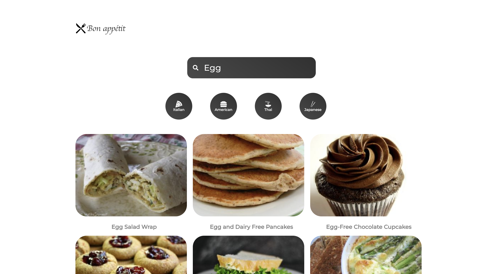
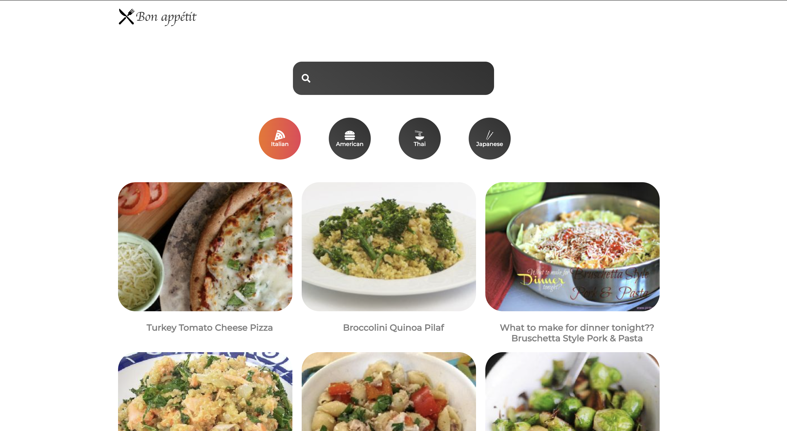
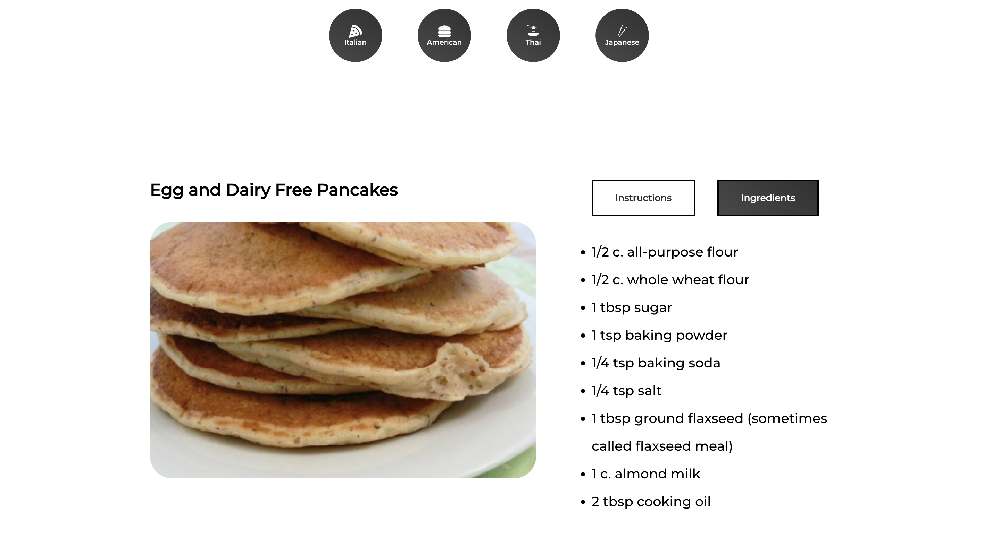

# React.js - Recipe App
Webapp developed using React.js and Spoonacular API,which helps the user to fetch details on a food item.Details includes ingredients,recipe,type etc.


## Screenshots






## Run Locally

Clone the project

```bash
  git clone https://github.com/H4K3R13/Recipe-ReactApp.git
```

Go to the project directory

```bash
  cd Recipe-ReactApp
```

Install dependencies

```bash
  npm install
```

Start the server

```bash
  npm run start
```
## Environment Variables

To run this project, you will need to add the following environment variables to your .env file

`REACT_APP_API_KEY`


## License

[](https://choosealicense.com/licenses/mit/)


## Authors

- [@H4K3R13](https://github.com/H4K3R13)

